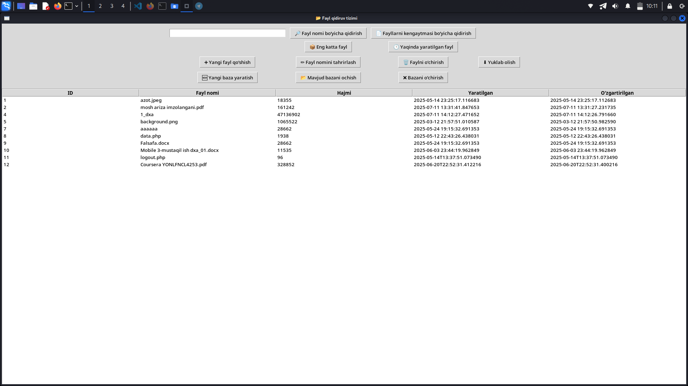
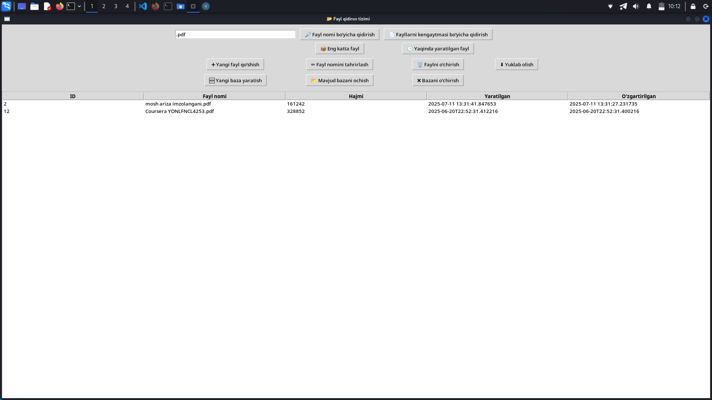

# 📂 Fayl boshqaruv tizimi Kali Linux uchun.

Bu loyiha Prokuratura kontekstida tayyorlangan Python dasturi bo‘lib, **fayl va hujjatlarni tahlil qilish, metadata chiqarish va zaxiralash** funksiyalarini bajaradi. GUI orqali intuitiv boshqarish imkoniyati mavjud.

## 🔧 Texnologiyalar
- Python 3.x
- Tkinter (GUI)
- SQLite (bazaga yozish)
- Openpyxl (Excelga eksport)

## ⚙️ Funksiyalar
1. Fayllarning metadatasini chiqarish (yaratilgan sana, hajm, formati)
2. Fayllarni qo‘shish, tahrirlash va o‘chirish
3. Fayllarni nomi yoki kengaytmasi bo‘yicha qidirish
4. Eng katta fayl va yaqinda yaratilgan fayllarni ko‘rsatish
5. Yangi baza yaratadi
6. Mavzud bazani ochib ishlatish imkoniyati
7. Bazani o'chirish imkoniyati


## 🖼 Screenshots


*Asosiy GUI oynasi*


*Qidiruv va natijalarni ko‘rsatish*

## 🚀 O‘rnatish va ishga tushirish

1. Loyihani klonlash:
```bash
git clone https://github.com/root7277/prokuratura_dalil_tahlil.git
cd prokuratura_dalil_tahlil


## ⚙️ Linux uchun o'rnatish.

    📂 dalil-tahlil_1.0_amd64.deb